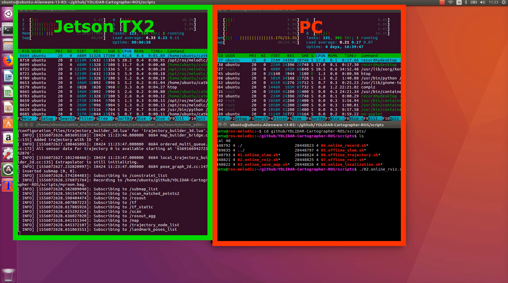
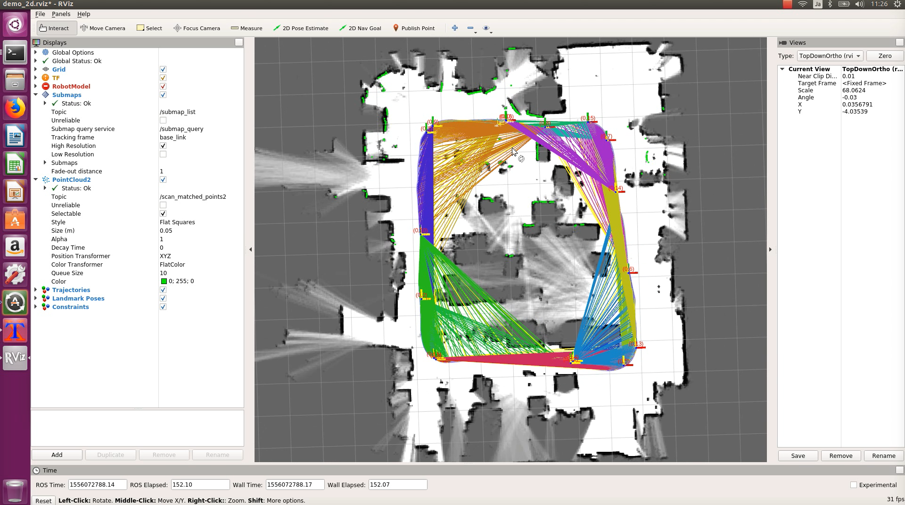
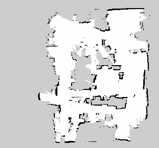
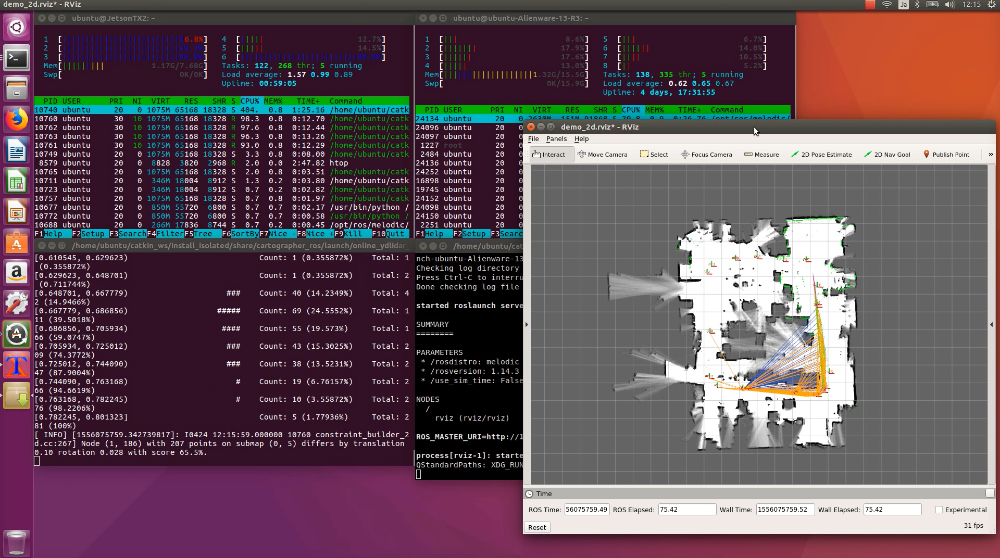
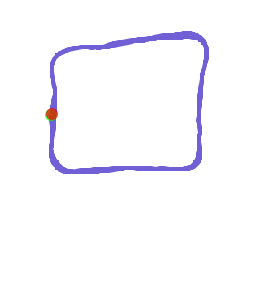

# Usage

1. setup ip address<br>
2. online SLAM (save to rosbag. save to pbstream)<br>
3. offline SLAM (use rosbag. save to pbstream)<br>
4. online Localization (use pbstream)<br>
5. Other<br>

online is realtime processing with YDLIDAR X4.<br>
offline is using rosbag play.<br>


## Movie
### online SLAM
[](https://www.youtube.com/watch?v=t7SFfHgnNus)
<br>

## offline SLAM
[](https://www.youtube.com/watch?v=kj3nSfnAl5s)

## online Localization
[](https://www.youtube.com/watch?v=gQTDASVGWfs)

## 1. setup ip address
edit `bash_export` file for your environmet.<br>
```
cd ~/catkin_ws/src/fabo_slam/(lidar)/scripts/
vi bash_export
```

on TX2(ip=192.168.0.41)
```
MASTER_IP=192.168.0.41
CLIENT_IP=192.168.0.41
```
on PC(ip=192.168.0.56)
```
MASTER_IP=192.168.0.41
CLIENT_IP=192.168.0.56
```
If you changed ip address of Hokuyo UST-10LX, then set the address.<br>
on TX2/PC
```
HOKUYO_UST_10LX=10.0.0.10
```

## 2. online SLAM
This is realtime SLAM.<br>
It is recommended to save to the rosbug.<br>

### SLAM
run on TX2(car)
```
cd ~/catkin_ws/src/fabo_slam/(lidar)/scripts/
./01.online_slam.sh myroom.bag
```

### RViz
run on PC
```
./02.online_rviz.sh
```

### Walk
Walk around the room.<br>


## Save to pbstream
Make room map for cartographer-ros localization.<br>
Run before exit `./01.online_slam.sh`.<br>
run on TX2
```
./03.online_save_pbstream.sh myroom.bag.pbstream
```

## Save to ros map
Make room map for ros navigation.<br>
Run before exit `./01.online_slam.sh`.<br>
run on TX2
```
./04.online_save_rosmap.sh
```
rosmap_2d_yyyymmddhhmmss.pgm` and `rosmap_2d_yyyymmddhhmmss.yaml` files are created.<br>


### Exit
Press `Ctrl + c` to exit.

## 3. offline SLAM
Make room map for localization.<br>
If you create pbstream with online SLAM, you can skip this.<br>
### Launch offline SLAM
run on TX2(car)
```
./06.offline_slam.sh myroom.bag
```
`myroom.bag.pbstream` file is created.<br>

run on PC
```
./08.offline_rviz.sh
```

## 4. online Localization
run on TX2(car)
```
./09.online_localization.sh myroom.bag.pbstream
```

run on PC
```
02.online_rviz.sh
```




## Save to ros map
Make room map for ros navigation.<br>
You need `myroom.bag` and `myroom.bag.pbstream`.<br>
```
./10.offline_save_rosmap.sh myroom.bag
```
Output: `myroiom.bag_map.pgm` and `myroom.bag_map.yaml`


## 5. Other
### Save lidar to rosbag
```
cd ~/catkin_ws/src/fabo_slam/(lidar)scripts/
./05.online_record.sh myroom.bag
```
Walk around the room. <br>
Quit with `Ctrl + c`.<br>

### Show Trajectory
If can see the trajectory.<br>
```
./07.offline_trajectory.sh myroom.bag myroom.bag.pbstream
```
`myroom.bag_points.ply` and `myroom.bag_*.png` files are created.<br>


## Kill process
If the process is left, kill it.
```
pgrep ros | xargs kill
```