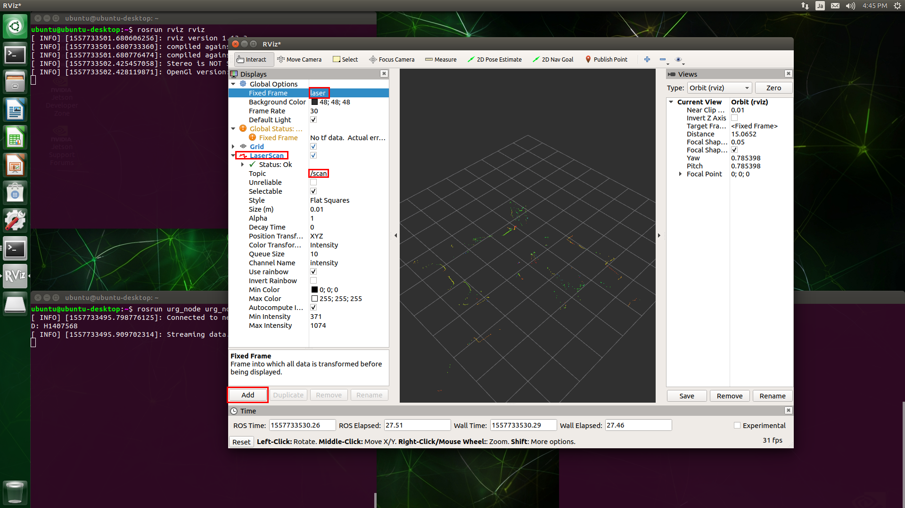

# Install Hokuyo ROS Driver


## Install
```
sudo apt-get install ros-melodic-urg-node
```

# Run
terminal 1:
```
roscore &
rosrun urg_node urg_node _ip_address:=192.168.0.10
```
terminal 2:
```
rosrun rviz rviz
```
change `Global Options->Fixed Frame` to `/laser`.<br>
add `LaserScan` and select `/scan` topic. (select /scan and enter key)<br>

